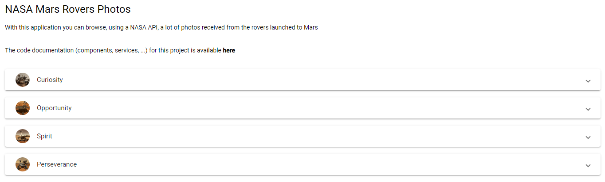

# NASA Mars Rovers Photos

This application shows information about the photos taken by the rovers that the NASA launched to Mars.

For make this uses an API provided by the NASA.

You can get more information about the NASA APIs in this url:

[https://api.nasa.gov/](https://api.nasa.gov/)

## Development server

This is a typical Angular application, so, you can run in your local machine running the development server.

For this you must navigate to the folder of the application, run, if it's necessary, `npm i` for install the dependencies and run the server with `npm start`. When the server is up, you can navigate to `http://localhost:4200` to load the application in a browser.

## Deployed version

You can use a deployed version of the application in this url:

[https://theguitxo.github.io/marsRoverPhotos/](https://theguitxo.github.io/marsRoverPhotos/)
